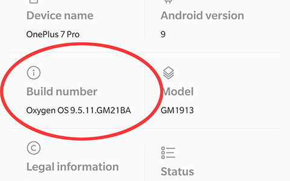
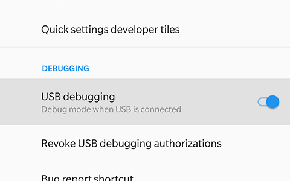
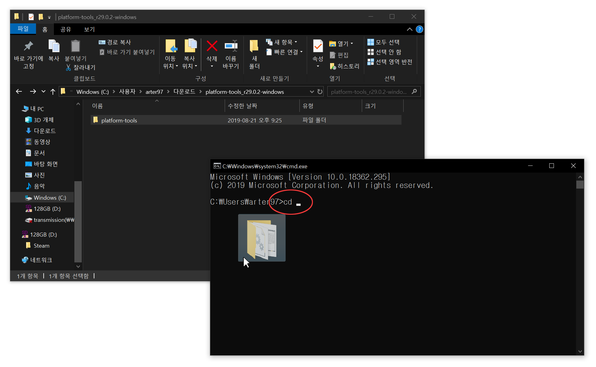
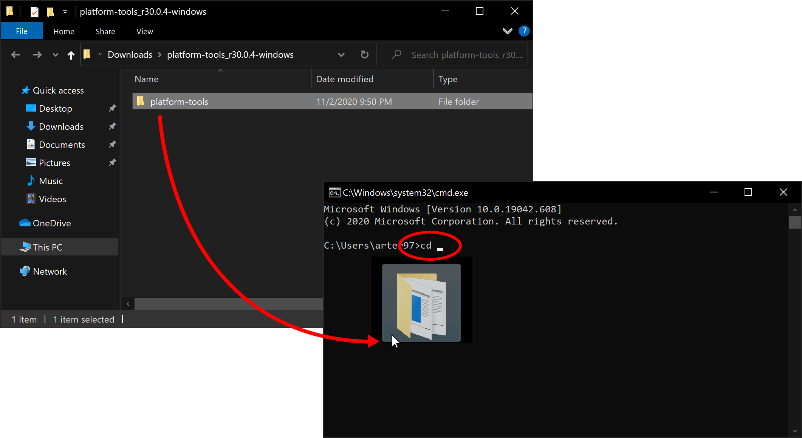
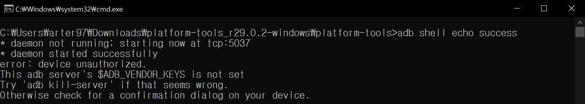
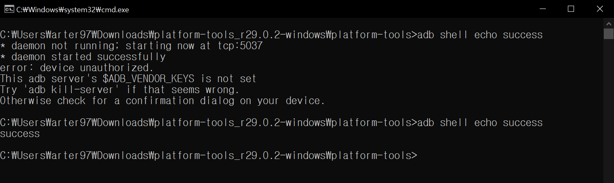
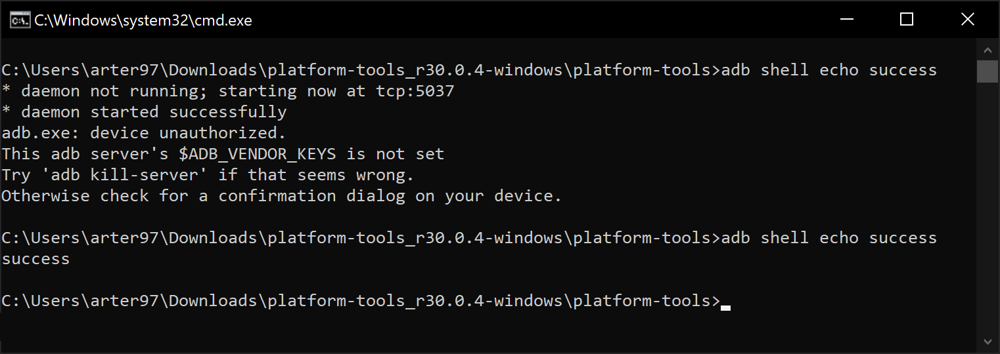
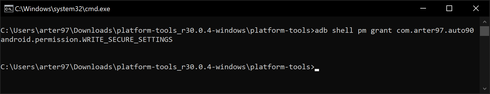

# AutoHz

Thanks for purchasing AutoHz!

For AutoHz to modify the system's display settings automatically, **secure write settings** permission has to be granted.

If you're rooted, AutoHz will attempt to do this automatically without a help from a computer. If you're prompted to do this operation manually while you're rooted, please check if you granted root permissions to AutoHz.

----------------------
### TL;DR

 * Run `adb shell pm grant com.arter97.auto90 android.permission.WRITE_SECURE_SETTINGS`

----------------------

### 1. Enable developer mode

 * Go to `Android Settings app` > `About phone` and tap `Build number` multiple times until the developer mode is enabled.



### 2. Enable USB debugging

 * Go to `Android Settings app` > `System` > `Developer options`, scroll down a page and enable `USB debugging` option.



### 3. Download ADB on your computer

 * Check [here](https://www.xda-developers.com/google-releases-separate-adb-and-fastboot-binary-downloads) and download ADB for your computer.

 * Extract the downloaded zip file.

### 4. Connect your phone to your computer

----------------------

### 5. Using command-line

#### 5.1. Windows: Open up CMD

 * Press `Windows + R` key on your keyboard.

 * Type `cmd` and hit enter.



#### 5.2. macOS: Open up Terminal

 * Search `Terminal` from Launchpad and run it.

 * Run `sudo -s` and type your user password. **The terminal won't display how much characters you type, it'll remain blank.**

 * Run `export PATH=.:$PATH`

 **Without this, you will get `adb: command not found` errors.**

### 6. Locate ADB

 * From the terminal window, type "cd ". **Notice the empty whitespace after the "cd".**

 * Locate the extracted `platform-tools` folder from Windows Explorer or Finder(macOS) and drag it over to the terminal window. It'll auto-fill the path.



 * Press enter.



### 7. Allow your computer to be used for USB debugging

 * Enter the following to the CMD window, followed by an enter:

 ```adb shell echo success```

 * You can copy the commands and paste it by **right-clicking on the CMD window**.



 * The command may show an error, **this is normal**. Your phone will prompt `Allow USB debugging` for you.

 * If it doesn't show an error, skip this step.


 * Tap `OK`.

 * Try `adb shell echo success` again. **It must print `success`**.



### 8. Grant write secure settings permission

 * Enter the following to the CMD window, followed by an enter:

 ```adb shell pm grant com.arter97.auto90 android.permission.WRITE_SECURE_SETTINGS```

 **Note that it's ```com.arter97.auto90``` and not ```com.arter97.autohz```.**

 **This is because AutoHz was previously named Auto90.**



 * If the command executed properly, it'll return silently.

### 9. Disable USB debugging

 * If you don't need USB debugging, it's a good practice to disable it to avoid potential unwanted access.

 * Go to `Android Settings app` > `System` > `Developer options`, scroll down a page and **disable** `USB debugging` option.

 * Run `adb kill-server` from the terminal window.

### 10. Done!

**That's it!**

You don't have to repeat this process unless you completely uninstall the app and reinstalls it.
